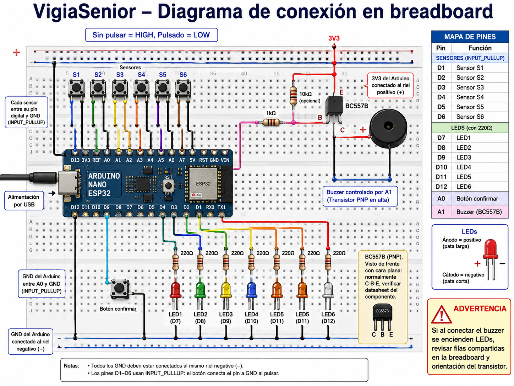
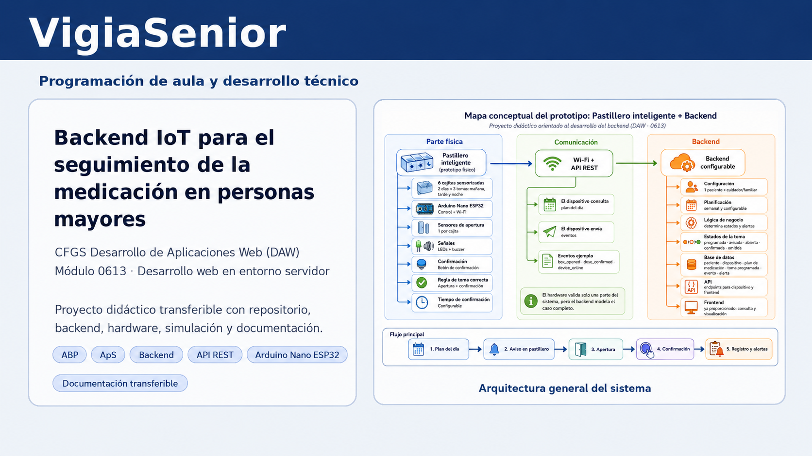

# VigiaSenior

<p align="center">
  <strong>Programación de aula y desarrollo técnico de un backend IoT para el seguimiento de la medicación en personas mayores</strong>
</p>

<p align="center">
  <em>CFGS Desarrollo de Aplicaciones Web (DAW) · Módulo 0613 - Desarrollo web en entorno servidor</em>
</p>

---

## 🧭 Introducción

Esto es un repositorio abierto para compartir una programación de aula del **CFGS de Desarrollo de Aplicaciones Web (DAW)** para el módulo **0613 - Desarrollo web en entorno servidor**, y en esta propuesta didáctica vamos a realizar el proyecto **VigiaSenior**. El proyecto se articula a partir de una situación de aprendizaje basada en el diseño e implementación del **backend de un pastillero inteligente**, pensado para apoyar el seguimiento de la medicación en personas mayores.

La propuesta parte de un problema real y socialmente significativo: la dificultad de mantener rutinas de medicación seguras, controladas y registrables en contextos de envejecimiento, dependencia o supervisión familiar. A partir de ese contexto, el alumnado desarrolla una solución tecnológica en la que convergen análisis, modelado de datos, servicios web, lógica de negocio, persistencia, documentación y una integración básica con hardware o simulación.

> Este repositorio se ha concebido con una doble finalidad:
>
> - Como **programación de aula transferible**, de manera que otro docente pueda comprenderla y aplicarla con pocas modificaciones;
> - Como **repositorio técnico del proyecto**, donde se recogen la implementación del backend, los recursos hardware, la simulación, la documentación técnica y los materiales de apoyo.

### Normativa
Para elaborar esta propuesta se ha tomado como referencia la normativa básica del sistema educativo y de la Formación Profesional, así como la normativa específica del título de **Técnico Superior en Desarrollo de Aplicaciones Web** y la normativa curricular aplicable en la **Comunitat Valenciana**.

La normativa completa puede consultarse en [profesorado/03_marco_legal.md](./profesorado/03_marco_legal.md).

### 🎓 Contexto académico

- **Etapa:** Formación Profesional  
- **Ciclo:** CFGS Desarrollo de Aplicaciones Web (DAW)  
- **Módulo eje:** 0613 · Desarrollo web en entorno servidor  
- **Metodología principal:** Aprendizaje Basado en Proyectos (ABP)  
- **Enfoque complementario:** Aprendizaje-Servicio (ApS), al plantear una solución con potencial utilidad social  

A nivel curricular, el proyecto permite trabajar de forma conjunta contenidos y procedimientos muy vinculados al módulo, como el desarrollo de servicios web, el acceso a bases de datos, la organización de la lógica de negocio y el diseño de una API. Al mismo tiempo, incorpora la integración de eventos procedentes de un dispositivo IoT y refuerza aspectos importantes como la documentación técnica y la exposición oral del proyecto.


---

## 🧩 Proyecto

En esta propuesta vamos a desarrollar **VigiaSenior**, un backend para un pastillero inteligente pensado para ayudar en el seguimiento de la medicación en personas mayores. Se trata de un proyecto que parte de una necesidad real y que permite dar sentido a los contenidos del módulo a través de una aplicación práctica, con un claro trasfondo social.

Su encaje dentro de **Desarrollo web en entorno servidor** es claro, ya que permite trabajar servicios web, bases de datos, lógica de negocio, diseño de endpoints e integración de eventos procedentes de un dispositivo. En lugar de abordar estos contenidos por separado, se trabajan de manera conjunta dentro de un proyecto único, más cercano a una situación real de desarrollo.

### 🔗 Acceso rápido


---

## 🎯 Objetivos del proyecto

Con esta propuesta se pretende que el alumnado sea capaz de:

- analizar un problema real y convertirlo en requisitos técnicos;
- diseñar el modelo de dominio de una aplicación basada en eventos;
- estructurar una API REST coherente y documentada;
- implementar la persistencia de datos mediante base de datos relacional;
- desarrollar lógica de negocio en servidor;
- integrar software y hardware en una arquitectura sencilla de IoT;
- documentar el proyecto de forma clara, trazable y reutilizable;
- defender oralmente la propuesta con base técnica y pedagógica.

---

## 🚀 Producto mínimo viable (MVP)

El producto mínimo viable del proyecto se apoya en un flujo funcional sencillo pero suficientemente sólido para trabajar en el aula:

- consulta de planificación diaria;
- recepción de eventos del dispositivo;
- registro de apertura de cajita;
- confirmación de la toma;
- actualización del estado de la toma;
- generación de alertas;
- consulta de dashboard e histórico básico.

### Endpoints mínimos del backend

- `GET /health`
- `GET /api/devices/:deviceId/schedule/today`
- `POST /api/devices/:deviceId/events`
- `GET /api/patients/:patientId/dashboard`
- `GET /api/patients/:patientId/alerts`
- `PATCH /api/alerts/:alertId/resolve`

---

## 🔌 Parte hardware del prototipo

La parte física se ha planteado en una versión simplificada y asumible para aula, basada en **Arduino Nano ESP32**, y se entrega al inicio del proyecto, ya que la finalidad principal de la propuesta es el **backend**, no el desarrollo eléctrico o la configuración hardware avanzada.

### Configuración del prototipo

- 6 pulsadores o sensores para simular la apertura de las cajitas;
- 6 LEDs de estado;
- 1 botón de confirmación;
- 1 buzzer;
- conexión Wi‑Fi en la versión con backend.

### Mapeo fijo de pines

- **D1–D6** → sensores / pulsadores  
- **D7–D12** → LEDs  
- **A0** → botón de confirmación  
- **A1** → buzzer  

<p align="center">
  
</p>

> Para una primera prueba se recomienda utilizar el sketch de **modo sin backend**, validar cableado y comportamiento local, y solo después pasar al sketch integrado con la API.

---

## 🗂️ Estructura del repositorio

La estructura del repositorio se ha organizado para que la parte **didáctica** y la parte **técnica** convivan sin mezclarse.

```text
VigiaSenior/
├── alumnado/
├── profesorado/
├── presentacion/
├── implementacion/
│   ├── backend/
│   ├── docs/
│   ├── hardware/
│   ├── prompts/
│   ├── recursos/
│   ├── simulacion/
│   └── mkdocs.yml
├── .gitignore
├── LICENSE
└── README.md
```

### 📘 `profesorado/`
Contiene la documentación pensada para la aplicación didáctica del proyecto:

- guía didáctica;
- contextualización y justificación;
- programación de aula;
- enfoque curricular;
- metodología y DUA;
- instrumentos y rúbricas de evaluación.

### 👨‍🎓 `alumnado/`
Recoge el material de trabajo del alumnado:

- dossier del proyecto;
- enunciado;
- fases y entregables;
- tutoriales;
- plantillas de análisis, API y documentación.


### ⚙️ `implementacion/`
Agrupa la parte estrictamente técnica del sistema:

- `backend/` → API, modelo de datos, lógica de negocio, validaciones y pruebas;
- `docs/` → documentación técnica navegable;
- `hardware/` → sketches Arduino, notas de conexión y esquemas;
- `prompts/` → apoyo para Copilot Agent;
- `recursos/` → materiales auxiliares;
- `simulacion/` → recursos para pruebas y simulación.

---

## 🧰 Materiales incluidos

### Para profesorado
- guía didáctica;
- programación de aula;
- contextualización;
- currículo y relación RA/CE;
- metodología y DUA;
- evaluación;
- rúbricas.

### Para alumnado
- dossier del proyecto;
- enunciado;
- fases y entregables;
- tutoriales;
- plantillas.

### Para la implementación
- backend;
- sketches Arduino;
- esquemas de conexión;
- documentación técnica;
- recursos de simulación;
- prompts de apoyo para Copilot Agent.

---

## 🛠️ Flujo de trabajo recomendado

Para trabajar el proyecto de forma ordenada, se propone la siguiente secuencia:

1. **comprender el problema y el contexto**;
2. **analizar actores, eventos y reglas de negocio**;
3. **diseñar el modelo de dominio**;
4. **definir la API REST**;
5. **implementar el backend**;
6. **probar la integración con hardware o simulación**;
7. **documentar el trabajo**;
8. **preparar la defensa oral**.

Este orden permite mantener una evolución lógica del proyecto y facilita tanto la evaluación como la transferencia a otros contextos docentes.

---

## 🧠 Metodología de aula

La propuesta se apoya en una metodología basada en:

- aprendizaje basado en proyectos;
- resolución de un problema significativo;
- trabajo cooperativo en pequeños grupos;
- desarrollo incremental por fases;
- uso de GitHub como herramienta de trazabilidad y documentación;
- revisión progresiva de entregables.

La parte técnica no se plantea como una simple acumulación de código, sino como un producto que debe ser **comprensible, justificable y transferible**.

---

## 📏 Evaluación

La evaluación del proyecto no se limita a verificar si “funciona” técnicamente, sino que contempla la coherencia global de la propuesta.

Se valoran especialmente:

- la adecuación curricular;
- la claridad de la programación de aula;
- la viabilidad del proyecto;
- la calidad técnica del backend;
- la documentación generada;
- la aplicabilidad del repositorio por parte de otro docente;
- la calidad de la presentación oral.

Las rúbricas y criterios de evaluación se encuentran en la carpeta `profesorado/`.

---

## 🗣️ Presentación y defensa

La parte final del proyecto no se reduce a mostrar código, sino a defender una propuesta didáctica y técnica integrada.

La presentación debe permitir explicar:

- el problema de partida;
- el encaje curricular;
- la situación de aprendizaje;
- la secuencia de trabajo;
- el producto técnico desarrollado;
- el valor del repositorio como material transferible;
- la demo funcional del backend y/o del prototipo.

---

## 📚 Documentación técnica navegable

Dentro de `implementacion/` se incluye configuración para **MkDocs**, con el objetivo de consultar la documentación técnica de forma estructurada.

Para levantar esa documentación:

```bash
cd implementacion
mkdocs serve
```

---

## 🧾 Cómo leer este repositorio

Si es la primera vez que accedes al proyecto, el orden de lectura recomendado es:

1. este `README.md`;
2. `profesorado/`;
3. `alumnado/`;
4. `presentacion/`;
5. `implementacion/backend/`;
6. `implementacion/hardware/`;
7. `implementacion/docs/`.

---

## ⚖️ Licencia y reutilización

El repositorio incluye una licencia en el archivo `LICENSE`.

En caso de reutilización docente, se recomienda mantener la atribución del proyecto y respetar el carácter académico de los materiales, especialmente de aquellos concebidos como propuesta transferible para aula.

---

## ✅ Cierre

**VigiaSenior** se plantea como una propuesta de aula con valor técnico, sentido social y estructura pedagógica clara. El objetivo no es únicamente construir un backend funcional, sino convertir ese desarrollo en una experiencia de aprendizaje coherente, bien documentada, evaluable y reutilizable.

En este sentido, el repositorio pretende ser algo más que un contenedor de archivos: busca actuar como una **maleta pedagógica y técnica**, preparada para ser comprendida, adaptada, aplicada y defendida.

<p align="center">
  
</p>